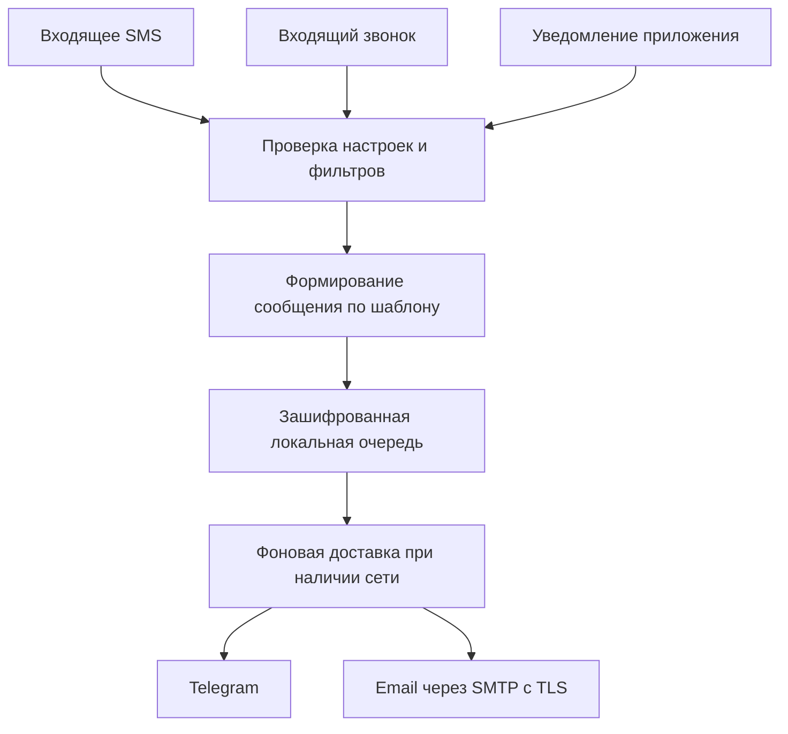
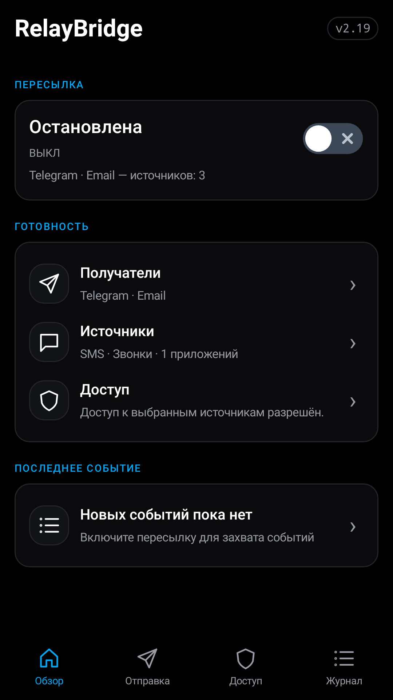
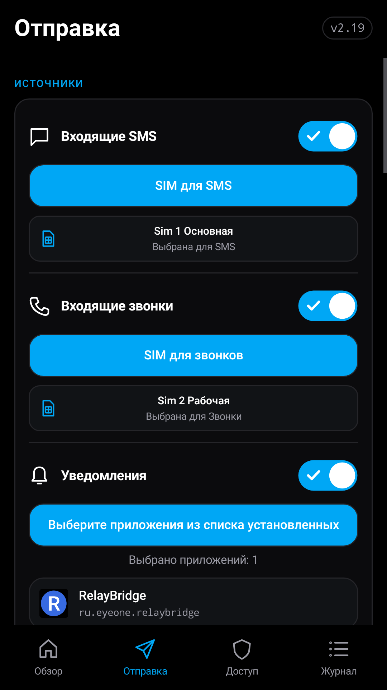
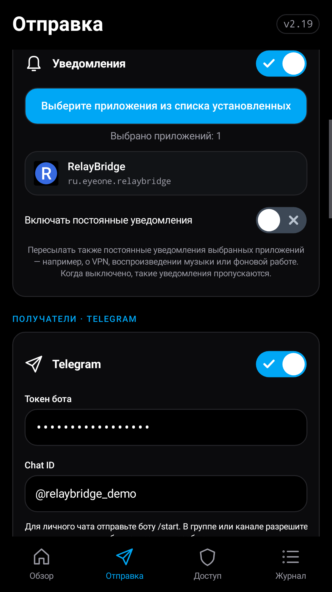
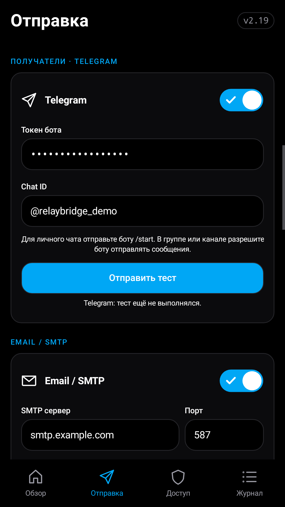
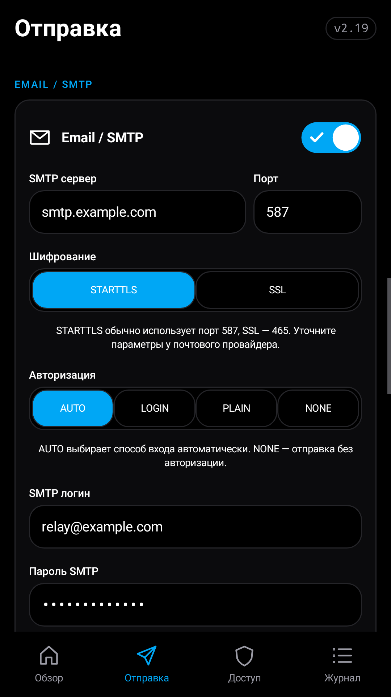
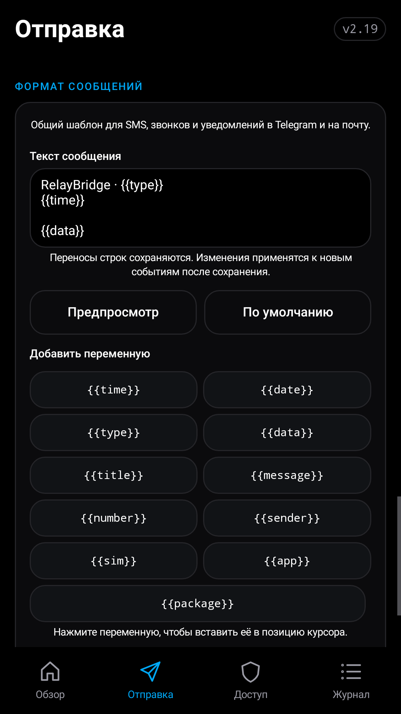
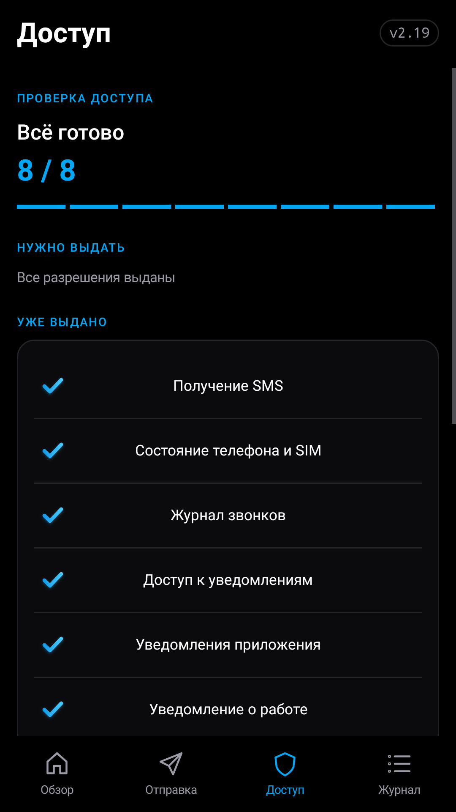
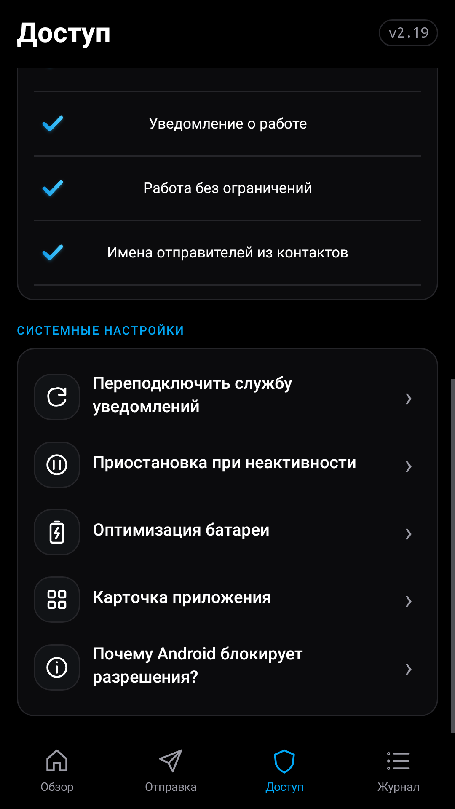
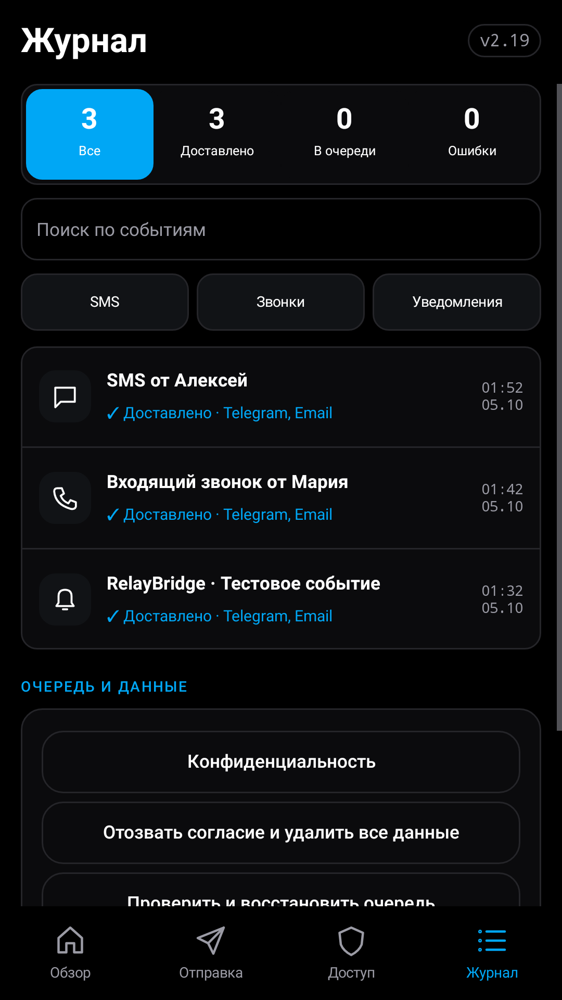

<div align="center">

# RelayBridge

**SMS, входящие звонки и уведомления Android — в Telegram и на почту.**

Бесплатное приложение с открытым исходным кодом: выбирайте события, получателей и формат сообщений.


[Возможности](#возможности) · [Скриншоты](#скриншоты) · [Настройка](#быстрый-старт) · [Шаблоны](#формат-сообщений) · [Сборка](#сборка-проекта)

</div>

---

## Для чего это приложение

RelayBridge помогает получать события со своего Android-телефона там, где их удобнее читать: в Telegram или по email. Например, можно пересылать SMS с дополнительного номера, узнавать о входящих звонках на второй SIM или собирать уведомления выбранных приложений в одном чате.

Вы управляете источниками и получателями. Для доставки используются ваш Telegram-бот и ваш SMTP-сервер. Отдельный сервер RelayBridge для пересылки не требуется.

В этом репозитории находится **нативный Java-проект для Android Studio**, версия **2.20**, код версии **37**.

## Возможности

| Возможность | Что можно настроить |
| --- | --- |
| **Входящие SMS** | Пересылка новых сообщений с номером отправителя и информацией о SIM |
| **Входящие звонки** | Сообщение о звонке с номером и SIM, на которую звонят |
| **Выбор SIM** | Все SIM или отдельные карты; настройки SMS и звонков независимы |
| **Уведомления приложений** | Список приложений для пересылки и обработка постоянных уведомлений |
| **Telegram** | Отправка через Bot Token в указанный чат или канал |
| **Email / SMTP** | Сервер, порт, отправитель, получатели и способ авторизации |
| **Шаблоны** | Общий формат текста для SMS, звонков и уведомлений с предпросмотром |
| **Очередь доставки** | Ожидание сети и повторные попытки при временных ошибках |
| **Журнал** | Содержимое событий, отдельные статусы Telegram и email, повтор неудачной доставки |
| **Диагностика** | Тесты Telegram и SMTP, журнал подключения и проверка доступа |
| **Управление данными** | Остановка пересылки, очистка очереди и журнала, отзыв согласия и удаление настроек |

Можно включить **Telegram, email или оба способа доставки одновременно**.

Номера SMS и звонков приводятся к международному формату с кодом страны (E.164). Для местного номера используется страна сети принимающей SIM, затем страна самой SIM. Например, `0447369039` для Австралии становится `+61447369039`. Уже указанный код страны сохраняется; скрытые номера, короткие коды и буквенные SMS-отправители не преобразуются. Если страна не определена, приложение сохраняет исходный номер и не подставляет код по языку телефона.

> Звонок пересылается как текстовое событие. Приложение не записывает разговоры и не передаёт аудио.

## Как это работает



1. Android сообщает приложению о новом событии.
2. RelayBridge проверяет, включён ли источник, подходит ли SIM или выбранное приложение.
3. Подставляет данные в шаблон и сохраняет готовое сообщение в очередь.
4. WorkManager планирует отправку при наличии сети.
5. Результат каждого способа доставки появляется в журнале. При временной ошибке приложение повторяет попытку с увеличением интервала.

Шаблон применяется **при захвате события**. Изменение шаблона влияет на новые события; повторная отправка сохраняет ранее сформированный текст.

## Быстрый старт

### 1. Настройте получателей

Откройте вкладку **«Отправка»** и включите Telegram и/или email.

| Telegram | Email / SMTP |
| --- | --- |
| Укажите токен своего бота | Укажите SMTP-сервер и порт |
| Введите числовой Chat ID или `@имя` канала | Выберите STARTTLS или SSL |
| Убедитесь, что бот может писать получателю | Задайте авторизацию и учётные данные |
| Выполните тест отправки | Укажите адрес отправителя и получателей, выполните тест |

Для SMTP поддерживаются **AUTO, LOGIN, PLAIN и NONE**. NONE означает отправку без авторизации, но защищённое соединение всё равно обязательно. Несколько email-получателей можно разделять запятыми или точками с запятой.

### 2. Выберите события

Во вкладке **«Отправка»**:

- Включите нужные источники: SMS, звонки и уведомления.
- Через **«SIM для SMS»** и **«SIM для звонков»** выберите карты для каждого источника.
- Для уведомлений отметьте приложения, сообщения которых нужно пересылать.
- При необходимости измените **«Формат сообщений»**.
- Нажмите **«Сохранить настройки»**.

### 3. Разрешите доступ

Во вкладке **«Доступ»** проверьте состояние разрешений и выдайте доступ для выбранных функций. Перед передачей данных приложение запрашивает явное согласие.

| Доступ | Для чего нужен |
| --- | --- |
| Получение SMS | Захват новых входящих SMS |
| Состояние телефона | События звонков и сведения об активных SIM |
| Журнал звонков | Получение номера входящего звонка |
| Контакты (необязательно) | Локальный поиск имени отправителя SMS/звонка по номеру |
| Доступ к уведомлениям | Чтение уведомлений выбранных приложений |
| Уведомления RelayBridge | Видимый индикатор включённой пересылки и возможность её остановить |
| Исключение из оптимизации батареи | Снижение ограничений фоновой работы, если это требуется на устройстве |

### 4. Включите пересылку

Во вкладке **«Обзор»** включите пересылку и проверьте готовность выбранных источников. Отправьте тестовое событие и посмотрите результат во вкладке **«Журнал»**.

## Разделы приложения

| Вкладка | Назначение |
| --- | --- |
| **Обзор** | Состояние пересылки, готовность источников, включение и остановка |
| **Отправка** | Источники событий, выбор SIM и приложений, Telegram, SMTP и шаблон текста |
| **Доступ** | Разрешения Android, фоновые ограничения и управление согласием |
| **Журнал** | История, статусы доставки, ошибки и действия с очередью |

## Скриншоты

Интерфейс RelayBridge **2.19** с демонстрационными данными. Нажмите на скриншот, чтобы открыть его в полном размере.

| Обзор | SMS и звонки | Уведомления приложений |
| :---: | :---: | :---: |
| <a href="docs/screenshots/2.19/01-overview.png"></a> | <a href="docs/screenshots/2.19/02-sms-calls.png"></a> | <a href="docs/screenshots/2.19/03-app-notifications.png"></a> |

| Telegram | Email / SMTP | Формат сообщений |
| :---: | :---: | :---: |
| <a href="docs/screenshots/2.19/04-telegram.png"></a> | <a href="docs/screenshots/2.19/05-email-smtp.png"></a> | <a href="docs/screenshots/2.19/06-message-format.png"></a> |

| Разрешения | Системные настройки | Журнал |
| :---: | :---: | :---: |
| <a href="docs/screenshots/2.19/07-permissions.png"></a> | <a href="docs/screenshots/2.19/08-system-settings.png"></a> | <a href="docs/screenshots/2.19/09-journal.png"></a> |

## Формат сообщений

Переменные записываются в двойных фигурных скобках: `{{переменная}}`. Переносы строк сохраняются.

Стандартный шаблон:

```text
RelayBridge · {{type}}
{{time}}

{{data}}
```

Пример сообщения о звонке:

```text
RelayBridge · Входящий звонок
2026-10-04 18:34:25 +03:00

SIM: Sim 2 Megafon
Номер: +420XXXXXXXXX
```

| Переменная | Значение |
| --- | --- |
| `{{time}}` | Дата и время захвата события с часовым поясом |
| `{{date}}` | Дата в формате YYYY-MM-DD |
| `{{type}}` | Тип события: SMS, входящий звонок или уведомление |
| `{{data}}` | Полные данные события, включая SIM/отправителя или приложение |
| `{{title}}` | Заголовок события |
| `{{message}}` | Текст SMS/уведомления либо номер звонка с подписью |
| `{{number}}` | Номер отправителя SMS или звонящего в международном формате, если его можно достоверно определить |
| `{{sender}}` | Имя из контактов или «Неизвестный отправитель» для SMS/звонка |
| `{{sim}}` | Название SIM для SMS или звонка |
| `{{app}}` | Название приложения, отправившего уведомление |
| `{{package}}` | Имя пакета приложения |

Недоступные поля подставляются как пустые строки. Шаблон может содержать до **4000 символов**; неизвестные переменные и незакрытые скобки проверяются при сохранении. HTML/Markdown автоматически не включается.

Для просмотра оформления используйте **предпросмотр шаблона**. Тесты подключения Telegram и SMTP отправляют отдельный технический текст.

## Данные и приватность

- Настройки, учётные данные и содержимое сообщений в локальной очереди шифруются с помощью **AES-GCM**. Ключ хранится в **Android Keystore**.
- Передача в Telegram выполняется по HTTPS; для SMTP обязательны **STARTTLS или SSL** с проверкой сертификата.
- Локальная история ограничена **500 событиями**; записи старше **7 дней** очищаются при обработке очереди или просмотре истории.
- Резервное копирование данных приложения через Android отключено.
- В «Доступе» можно отозвать согласие и удалить настройки, пароли, очередь и журнал.
- Уже отправленные сообщения остаются у получателей в Telegram и почте. Их удаление выполняется отдельно.

Подробнее: [проект политики конфиденциальности](PRIVACY-POLICY.html).

## Особенности Android

RelayBridge работает на **Android 15 и новее**. Для SMS и звонков нужен телефон с соответствующими возможностями.

- Приложение обрабатывает новые события после включения пересылки; импорт старой переписки не предусмотрен.
- Android и прошивка могут скрывать номер звонящего, текст уведомления или сведения о SIM.
- Если SIM звонка определить нельзя, приложение указывает **«SIM не определена»**. При фильтрации по отдельным SIM такой звонок пропускается.
- После замены SIM/eSIM проверьте выбранные карты заново.
- При отключении уведомлений RelayBridge захват и доставка приостанавливаются.
- Система может задерживать фоновые задания. После принудительной остановки приложение нужно открыть снова.
- Доставка email означает принятие сообщения SMTP-сервером; папку «Спам» стоит проверять отдельно.

## Сборка проекта

### Требования

- Android Studio с поддержкой Android Gradle Plugin проекта.
- **JDK 17**, **Python 3**.
- Android SDK Platform **36** и Build Tools **35.0.0**.
- Gradle **8.11.1** поставляется через wrapper.

Откройте корень репозитория в Android Studio и дождитесь синхронизации Gradle. Укажите путь к Android SDK через настройки IDE или `local.properties`.

### Локальная Release-сборка

Из корня проекта:

```bash
python3 scripts/prepare-build.py
python3 scripts/check-wrapper.py
chmod +x gradlew
./gradlew --no-daemon -PrelayAbi=arm64-v8a \
  -PrelayDevelopmentSigning=true testDebugUnitTest lintRelease assembleRelease
```

На Windows используйте `gradlew.bat` вместо `./gradlew`.

Готовый APK: `app/build/outputs/apk/release/app-release.apk`.

Скрипт подготовки создаёт тестовый TLS-сертификат и локальный тестовый ключ подписи, если их ещё нет. Сохраняйте этот ключ для совместимости своих последующих тестовых сборок; файлы ключей исключены из Git.

Текущий проект не содержит нативных `.so`-библиотек: Java APK совместим с ARMv8. Параметр `relayAbi=arm64-v8a` ограничивает архитектуру будущих нативных зависимостей.

### Подпись владельца

Для Release-подписи собственным ключом используются переменные окружения:

| Переменная | Значение |
| --- | --- |
| `RELAY_UPLOAD_STORE` | Путь к keystore |
| `RELAY_UPLOAD_STORE_PASSWORD` | Пароль хранилища |
| `RELAY_UPLOAD_ALIAS` | Псевдоним ключа |
| `RELAY_UPLOAD_KEY_PASSWORD` | Пароль ключа |

При заданном `RELAY_UPLOAD_STORE` этот ключ имеет приоритет. Без собственного ключа и без `-PrelayDevelopmentSigning=true` Release APK остаётся неподписанным.

Android допускает обновление установленного приложения только при совместимой подписи и допустимом коде версии. APK с новым тестовым ключом не обновит установку, подписанную другим ключом.

### GitHub Actions

**Автоматические запуски отключены.** Push, pull request и создание тегов не запускают сборку.

Ручной workflow: **Actions → RelayBridge APK Release → Run workflow**. Он выполняет тесты, lint, Release-сборку и проверку APK, сохраняет APK и отчёты как артефакты. Публикация в GitHub Releases включается отдельным параметром и по умолчанию выключена.

Для постоянной подписи в Actions задайте Repository Secrets:

- `RELAY_UPLOAD_KEYSTORE_BASE64`
- `RELAY_UPLOAD_STORE_PASSWORD`
- `RELAY_UPLOAD_ALIAS`
- `RELAY_UPLOAD_KEY_PASSWORD`

Если Secrets отсутствуют, каждый запуск создаёт новый временный тестовый ключ. Уже опубликованный релиз workflow не перезаписывает.

## Структура проекта

| Путь | Содержимое |
| --- | --- |
| [app/src/main/java/ru/eyeone/relaybridge](app/src/main/java/ru/eyeone/relaybridge) | Интерфейс, захват событий, настройки, очередь и доставка |
| [app/src/main/res](app/src/main/res) | Стили и адаптивная иконка |
| [app/src/test](app/src/test) | Модульные тесты, включая SMTP/TLS, шаблоны и фильтры SIM |
| [app/src/androidTest](app/src/androidTest) | Инструментальные проверки Android |
| [scripts](scripts) | Подготовка ключей, проверка wrapper и APK, упаковка релиза |
| [.github/workflows](.github/workflows) | Ручная Release-сборка |

## Развитие проекта

О проблемах и предложениях можно сообщить через [Issues](https://github.com/GuardConnect/RelayBridge/issues). Для ошибки укажите версию Android, модель устройства, версию приложения и шаги воспроизведения. Перед публикацией лога удалите номера, тексты сообщений, токены и пароли.

## Лицензия

Проект распространяется по [Unlicense](LICENSE). Исходники можно свободно использовать, изменять и распространять.
